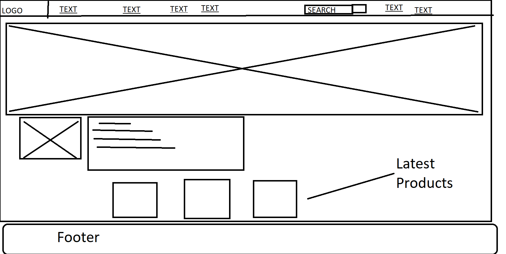
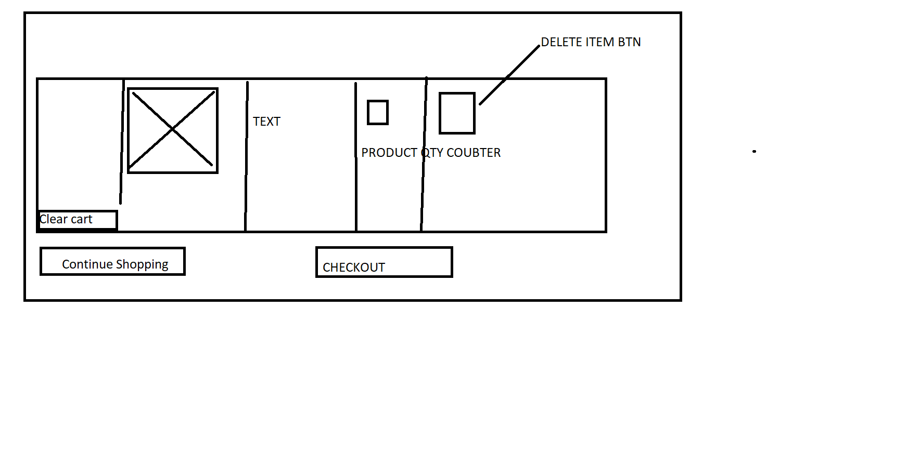
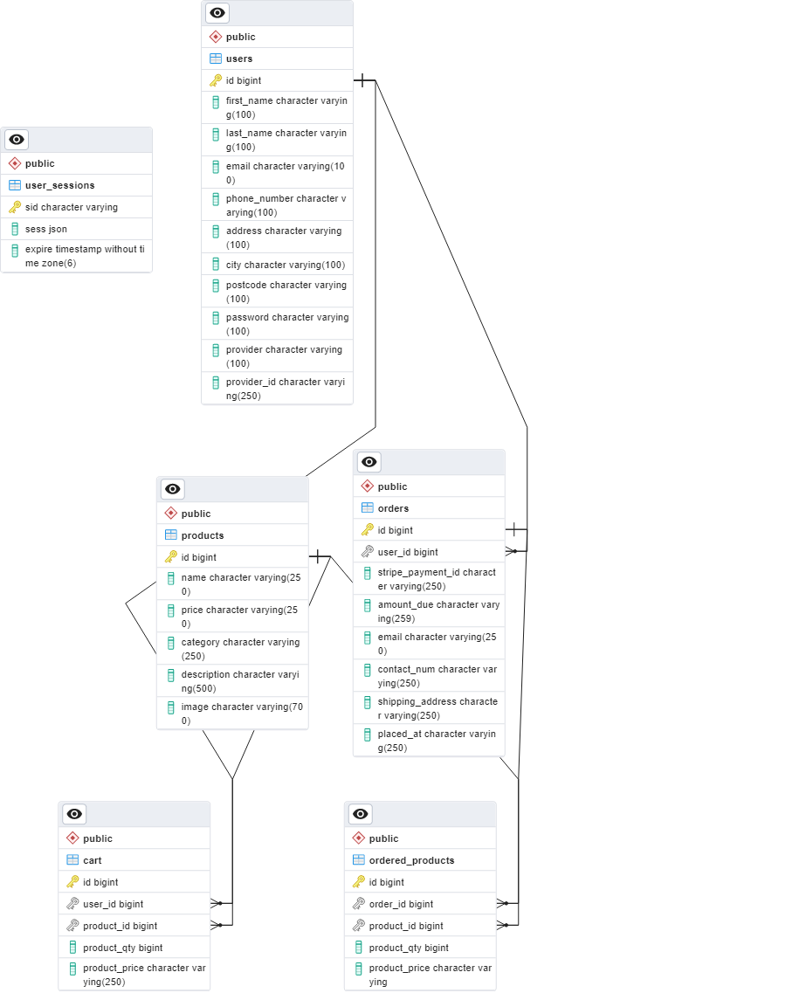
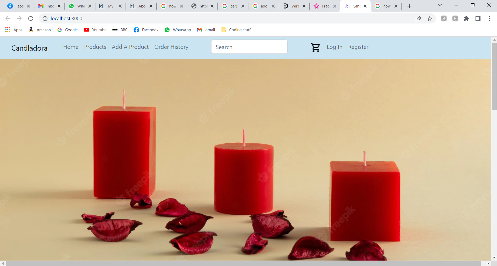
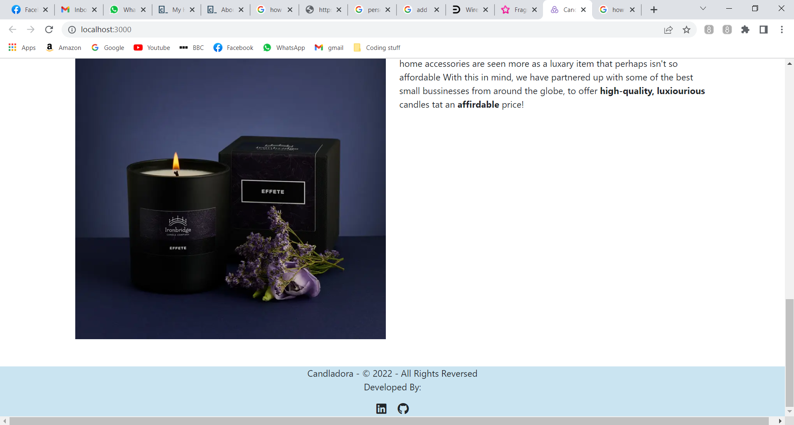
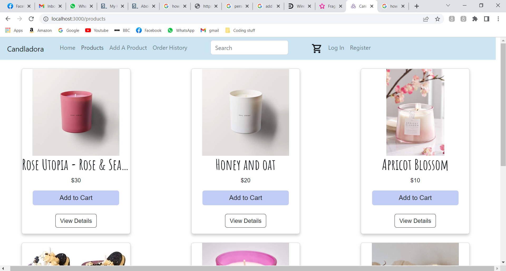
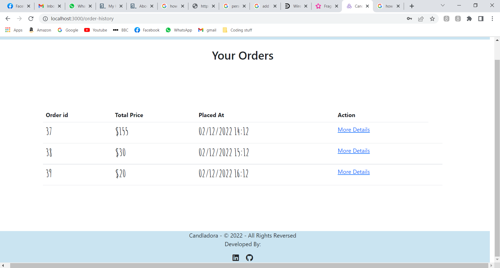
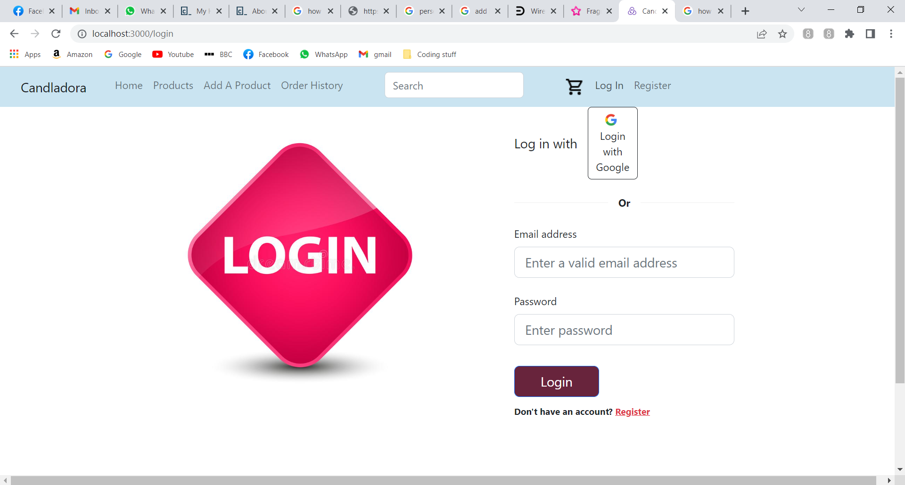
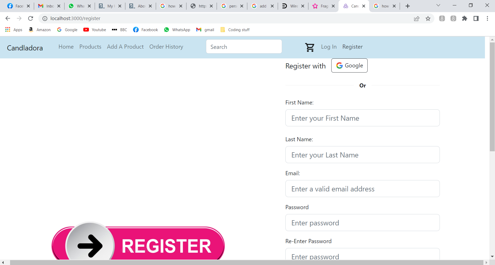

# PERN Stack E-commerce

I made this project in order to demonstrate all of the skills that I have learnt in [Codecademy's ](https://www.codecademy.com) Full Stack Engineer career path.

## Languages and Frameworks Used

- PostgreSQL
- Expressjs
- Reactjs
- Nodejs
- React Router
- Redux
- Axios
- GitHub
- YAML
- Swagger Editor
- Open API
- Font Awesome
- CSS
- Bootstrap 5
- Markdown
- Passportjs
- passport-sessions
- local-sessions
- Google Developer Console
- dotenv
- Stack Overflow 
- PgAdmin 4
- CommandLine/ Powershell 

## Key Features

- Local Login and Register
- Login with OAuth 2.0
- logout functionality
- Protected Routes
- Add a Product
- Update User Information
- Add, Update & D elete Items Fron Cart
- Make Payments with Stripe
- View Order History and Specific Orders

## .env Files

In order for this project to work locally on youer device, you will need to:

1. Install the dependencies (npm install OR npm i )
2. configure the .env files to run on your machine.

This project has 2 .env files - a frontend and backend. Both of these files contain variables that are specific to the way that I set up my :

- database and tables
- API Routes
- sessions
- payment proccessor

An environment variables (env) file relates to valiables that are specific to eacgh part of the application (frontend and backend implementation.) To customise them so that they intergrate into your own project...

Navigate to the frontend or backenx folder > Click on .env and edit the variable names as you see approprate. If you do not customise the environmrnt variables you may expirence erors with the code in this repository.

## Things I've learnt whilst making this Poroject

I made this project as part of the 'full-Stack Engineer Career Path' on Codecademy. This is my first ever PERN-Stack app, so as you can imagine I have learnt alot during this process.

One of the things that I have learnt is, how to use pool to connect and query a PSQL database in a project. I learnt this by following the pool docs and addapting my code accordingly.

I've also discovered protected routes are used in React-Router to only show routes based on a certain vodition in an application. I Whilst on the topic of React-Router, I built this project using version 6.4.2, but I am aware that in the midst of building this app, the syntax has been updated slightly. With this in mind, I will be updating the React-Router syntax in due-tine.

Another thing that I have learnt is how remote databses work. Prior to building this application I was not aware of what a remote database was or how they worked. Instead, I was using PgAdmin and the commandline to create a local databse.

This was a problem when it came to attempting to deploy the application, as I had to host a version of my local database in order for the application to work. To comvate this I did some reserach into remote databases and the different options when it came to hosting sites and how to connect the remote databse and my local datavase. This was something I struggled with greatly because I had to pukll information together from various sources. However once I completed it I felt a great sense of achievement when I finally managed to do it.

The final and most important thing that I've learnt whilst building this project is gow to problem-solve, debug and persevere. Theese are vital skills for a developer and I believe that I am well on my way to perfecting these skills and building ny confidence in the future.

## Things that I enjoyed
Since this is my first attept at a PERN-Stack app, I really enjoyed building it and watching all my knowledge being transsformed into an actual E-commerce store. 

I also enjoyed, how much of a challenge it was to debug the errors and find alternative ways of impl1ementing the same feature. For example, when I first implemented local-sessions with -  express-sessions, there were multiple bugs that where caused by using the MemoryStore strateogy. After searching for solutions, I foubnd that it was advised to store sessions in a database. I enjoyed this because I liked exploring other peoples' solutions and taking through my isues with more experienced developers.

## Roadblocks and changes to Approach 
Whilst building this project, there where a few instances that occured which forced me to change my approach to coding this app. For example, the requirements that where set by Codecademy asked me to deploy to Heroku. However, at the time of completing this application, the Heroku free-tier has been depricated and the paied plans are out of my budget at the moment. 

Then I thought I could deploy my frontend and backend on Vercel and then host my database on ElephentSQL. However, this wasn't possible, because Vercel required a lot of configurations to the code - which when implemented  caused errors in the codde that where specific to Vercel. This was an issue because the Vercel errors wheree caused by using the free-tier and to fix them, would've meant that the requirements wouldn't have been met in the desired timeframe. 

As a result of theese issues, the application is only functional locally. However, I am actively searching for a more sustainable way of deploying thid project

## Wireframes

#### Homepage

#### Products Page

#### Product Details Page

#### Cart Page

## Database Schema

#### App Interfaces

## Getting Started with Create React App

This project was bootstrapped with [Create React App](https://github.com/facebook/create-react-app).

## Available Scripts

### `npm start`

Runs the app in the development mode.\
Open [http://localhost:3000](http://localhost:3000) to view it in your browser.

The page will reload when you make changes.
You may also see any lint errors in the console.
